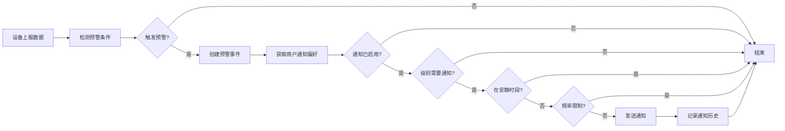

# 通知功能 API 使用指南

## API 端点

### 1. 获取通知偏好配置

获取当前用户的通知偏好设置。

**请求：**
```http
GET /api/v1/notifications/preferences
Authorization: Bearer <JWT_TOKEN>
```

**响应示例：**
```json
{
  "status": "success",
  "data": {
    "id": "550e8400-e29b-41d4-a716-446655440000",
    "user_id": "123e4567-e89b-12d3-a456-426614174000",
    "enabled": true,
    "email_enabled": true,
    "email_address": "user@example.com",
    "webhook_enabled": false,
    "webhook_url": null,
    "notify_info": false,
    "notify_warning": true,
    "notify_critical": true,
    "quiet_hours_start": "22:00:00",
    "quiet_hours_end": "08:00:00",
    "quiet_hours_timezone": "Asia/Shanghai",
    "min_notification_interval": 5,
    "created_at": "2026-01-20T10:00:00Z",
    "updated_at": "2026-01-20T10:00:00Z"
  }
}
```

### 2. 更新通知偏好配置

更新当前用户的通知偏好设置。所有字段都是可选的，只更新提供的字段。

**请求：**
```http
PUT /api/v1/notifications/preferences
Authorization: Bearer <JWT_TOKEN>
Content-Type: application/json
```

**请求体示例 - 完整配置：**
```json
{
  "enabled": true,
  "email_config": {
    "enabled": true,
    "email": "user@example.com"
  },
  "webhook_config": {
    "enabled": true,
    "url": "https://your-webhook.com/alerts",
    "secret": "your-webhook-secret",
    "headers": {
      "X-Custom-Header": "value"
    }
  },
  "notify_info": false,
  "notify_warning": true,
  "notify_critical": true,
  "quiet_hours_start": "22:00",
  "quiet_hours_end": "08:00",
  "quiet_hours_timezone": "Asia/Shanghai",
  "min_notification_interval": 10
}
```

**请求体示例 - 仅启用邮件通知：**
```json
{
  "enabled": true,
  "email_config": {
    "enabled": true,
    "email": "alerts@mycompany.com"
  },
  "notify_critical": true
}
```

**请求体示例 - 禁用所有通知：**
```json
{
  "enabled": false
}
```

**响应示例：**
```json
{
  "status": "success",
  "data": {
    "id": "550e8400-e29b-41d4-a716-446655440000",
    "user_id": "123e4567-e89b-12d3-a456-426614174000",
    "enabled": true,
    "email_enabled": true,
    "email_address": "alerts@mycompany.com",
    "webhook_enabled": false,
    "webhook_url": null,
    "notify_info": false,
    "notify_warning": true,
    "notify_critical": true,
    "quiet_hours_start": null,
    "quiet_hours_end": null,
    "quiet_hours_timezone": "UTC",
    "min_notification_interval": 5,
    "created_at": "2026-01-20T10:00:00Z",
    "updated_at": "2026-01-20T10:30:00Z"
  }
}
```

## 配置说明

### 通用配置

| 字段 | 类型 | 必填 | 说明 |
|------|------|------|------|
| `enabled` | boolean | 否 | 全局通知开关 |
| `min_notification_interval` | integer | 否 | 最小通知间隔（分钟），范围：1-1440 |

### 邮件通知配置

| 字段 | 类型 | 必填 | 说明 |
|------|------|------|------|
| `email_config.enabled` | boolean | 是 | 是否启用邮件通知 |
| `email_config.email` | string | 是 | 接收通知的邮箱地址 |

### Webhook 通知配置

| 字段 | 类型 | 必填 | 说明 |
|------|------|------|------|
| `webhook_config.enabled` | boolean | 是 | 是否启用 Webhook 通知 |
| `webhook_config.url` | string | 是 | Webhook 接收地址 |
| `webhook_config.secret` | string | 否 | 用于签名验证的密钥 |
| `webhook_config.headers` | object | 否 | 自定义 HTTP 头 |

### 预警级别过滤

| 字段 | 类型 | 必填 | 说明 |
|------|------|------|------|
| `notify_info` | boolean | 否 | 是否接收信息级别预警 |
| `notify_warning` | boolean | 否 | 是否接收警告级别预警 |
| `notify_critical` | boolean | 否 | 是否接收严重级别预警 |

### 安静时段配置

| 字段 | 类型 | 必填 | 说明 |
|------|------|------|------|
| `quiet_hours_start` | string | 否 | 安静时段开始时间（HH:MM 格式） |
| `quiet_hours_end` | string | 否 | 安静时段结束时间（HH:MM 格式） |
| `quiet_hours_timezone` | string | 否 | 时区（如：Asia/Shanghai, America/New_York） |

## 使用场景示例

### 场景 1：只接收严重预警的邮件通知

适用于希望减少干扰，只关注严重问题的用户。

```bash
curl -X PUT http://localhost:8080/api/v1/notifications/preferences \
  -H "Authorization: Bearer YOUR_TOKEN" \
  -H "Content-Type: application/json" \
  -d '{
    "enabled": true,
    "email_config": {
      "enabled": true,
      "email": "critical-alerts@company.com"
    },
    "notify_info": false,
    "notify_warning": false,
    "notify_critical": true,
    "min_notification_interval": 5
  }'
```

### 场景 2：设置夜间安静时段

工作日接收所有通知，但夜间（22:00-08:00）不接收。

```bash
curl -X PUT http://localhost:8080/api/v1/notifications/preferences \
  -H "Authorization: Bearer YOUR_TOKEN" \
  -H "Content-Type: application/json" \
  -d '{
    "enabled": true,
    "email_config": {
      "enabled": true,
      "email": "user@example.com"
    },
    "notify_warning": true,
    "notify_critical": true,
    "quiet_hours_start": "22:00",
    "quiet_hours_end": "08:00",
    "quiet_hours_timezone": "Asia/Shanghai"
  }'
```

### 场景 3：多渠道通知（邮件 + Webhook）

同时使用邮件和 Webhook 接收预警。

```bash
curl -X PUT http://localhost:8080/api/v1/notifications/preferences \
  -H "Authorization: Bearer YOUR_TOKEN" \
  -H "Content-Type: application/json" \
  -d '{
    "enabled": true,
    "email_config": {
      "enabled": true,
      "email": "ops-team@company.com"
    },
    "webhook_config": {
      "enabled": true,
      "url": "https://hooks.slack.com/services/YOUR/SLACK/WEBHOOK",
      "headers": {
        "Content-Type": "application/json"
      }
    },
    "notify_warning": true,
    "notify_critical": true,
    "min_notification_interval": 10
  }'
```

### 场景 4：临时禁用通知

需要维护时临时禁用所有通知。

```bash
curl -X PUT http://localhost:8080/api/v1/notifications/preferences \
  -H "Authorization: Bearer YOUR_TOKEN" \
  -H "Content-Type: application/json" \
  -d '{
    "enabled": false
  }'
```

## 错误处理

### 常见错误

#### 1. 未认证
```json
{
  "status": "error",
  "message": "未认证"
}
```
**解决方案：**检查 JWT token 是否正确。

#### 2. 邮件服务未启用
```json
{
  "status": "error",
  "message": "邮件服务未启用"
}
```
**解决方案：**联系管理员配置 SMTP 设置。

#### 3. 验证失败
```json
{
  "status": "error",
  "message": "通知间隔应在 1-1440 分钟之间"
}
```
**解决方案：**检查请求参数是否符合验证规则。

## 通知触发流程



## 最佳实践

### 1. 合理设置通知级别

根据实际需求配置：
- **开发环境**：接收所有级别（Info/Warning/Critical）
- **测试环境**：接收 Warning + Critical
- **生产环境**：只接收 Critical，或 Warning + Critical

### 2. 配置适当的频率限制

- **默认建议**：5-10 分钟
- **高频监控**：1-3 分钟（可能产生大量通知）
- **低频检查**：30-60 分钟（适合非关键设备）

### 3. 使用安静时段

避免夜间打扰，同时确保关键预警能及时响应：
- 对非生产设备设置安静时段
- Critical 级别预警考虑绕过安静时段（可联系管理员配置）

### 4. 多渠道冗余

重要系统建议配置：
- **邮件**：详细信息和历史记录
- **Webhook**：实时推送到即时通讯工具（Slack, 钉钉等）

### 5. 定期检查通知历史

监控通知的发送情况：
- 检查是否有大量失败
- 确认通知是否及时送达
- 根据实际情况调整配置

## 集成示例

### Python 客户端示例

```python
import requests

class ZinniaNotificationClient:
    def __init__(self, base_url, token):
        self.base_url = base_url
        self.headers = {
            "Authorization": f"Bearer {token}",
            "Content-Type": "application/json"
        }
    
    def get_preferences(self):
        """获取通知偏好"""
        url = f"{self.base_url}/api/v1/notifications/preferences"
        response = requests.get(url, headers=self.headers)
        return response.json()
    
    def update_preferences(self, config):
        """更新通知偏好"""
        url = f"{self.base_url}/api/v1/notifications/preferences"
        response = requests.put(url, headers=self.headers, json=config)
        return response.json()
    
    def enable_critical_only(self, email):
        """只接收严重预警"""
        config = {
            "enabled": True,
            "email_config": {
                "enabled": True,
                "email": email
            },
            "notify_info": False,
            "notify_warning": False,
            "notify_critical": True
        }
        return self.update_preferences(config)

# 使用示例
client = ZinniaNotificationClient("http://localhost:8080", "your-jwt-token")
result = client.enable_critical_only("admin@example.com")
print(result)
```

### JavaScript/TypeScript 示例

```typescript
class ZinniaNotificationClient {
  constructor(
    private baseUrl: string,
    private token: string
  ) {}

  async getPreferences() {
    const response = await fetch(
      `${this.baseUrl}/api/v1/notifications/preferences`,
      {
        headers: {
          'Authorization': `Bearer ${this.token}`,
        },
      }
    );
    return response.json();
  }

  async updatePreferences(config: NotificationConfig) {
    const response = await fetch(
      `${this.baseUrl}/api/v1/notifications/preferences`,
      {
        method: 'PUT',
        headers: {
          'Authorization': `Bearer ${this.token}`,
          'Content-Type': 'application/json',
        },
        body: JSON.stringify(config),
      }
    );
    return response.json();
  }

  async setQuietHours(start: string, end: string, timezone: string) {
    return this.updatePreferences({
      quiet_hours_start: start,
      quiet_hours_end: end,
      quiet_hours_timezone: timezone,
    });
  }
}

// 使用示例
const client = new ZinniaNotificationClient(
  'http://localhost:8080',
  'your-jwt-token'
);

// 设置安静时段
await client.setQuietHours('22:00', '08:00', 'Asia/Shanghai');
```

## 支持的时区

常用时区列表：
- `UTC` - 协调世界时
- `Asia/Shanghai` - 中国标准时间
- `America/New_York` - 美国东部时间
- `Europe/London` - 英国时间
- `Asia/Tokyo` - 日本标准时间

完整时区列表请参考：[IANA Time Zone Database](https://www.iana.org/time-zones)

## 常见问题

### Q: 为什么我没有收到通知？

检查以下项：
1. 全局通知开关是否启用（`enabled: true`）
2. 相应渠道是否配置并启用
3. 预警级别过滤设置
4. 是否在安静时段内
5. 是否触发频率限制
6. SMTP 配置是否正确

### Q: 如何测试通知配置？

1. 创建测试预警规则（较低的阈值）
2. 手动上报触发阈值的数据
3. 检查是否收到通知
4. 查看通知历史记录

### Q: 通知延迟多久？

通常在预警触发后几秒内发送，具体取决于：
- SMTP 服务器响应速度
- 系统负载情况
- 网络状况

### Q: 能否接收所有设备的预警？

可以。通知系统会自动发送用户名下所有设备的预警通知。如需针对特定设备的通知策略，可通过预警规则配置实现。
